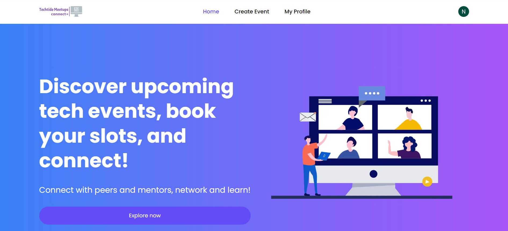

<a name="readme-top"></a>

<div align="center">
  <!-- You are encouraged to replace this logo with your own! Otherwise you can also remove it. -->
  
  <br/>

  <h3><b>TechTide MeetUps</b></h3>

</div>

<!-- TABLE OF CONTENTS -->

# 📗 Table of Contents

- [📖 About the Project](#about-project)

  - [🛠 Built With](#built-with)
    - [Tech Stack](#tech-stack)
    - [Key Features](#key-features)
  - [🚀 Live Demo](#live-demo)

- [💻 Getting Started](#getting-started)
  - [Setup](#setup)
  - [Prerequisites](#prerequisites)
  - [Install](#install)
  - [Usage](#usage)
  - [Run tests](#run-tests)
  - [Deployment](#deployment)
- [👥 Authors](#authors)
- [🔭 Future Features](#future-features)
- [🤝 Contributing](#contributing)
- [⭐️ Show your support](#support)
- [🙏 Acknowledgements](#acknowledgements)
- [❓ FAQ (OPTIONAL)](#faq)
- [📝 License](#license)

<!-- PROJECT DESCRIPTION -->

# 📖 Techtide Meetups <a name="about-project"></a>

**Techtide Meetups** is  a tech event-management application built with the aim to connect developers around the world and locally to network and share knowledge.


## 🛠 Built With <a name="built-with"></a>

### Tech Stack <a name="tech-stack"></a>

<details>
  <summary>Client</summary>
  <ul>
    <li>Next.js</li>
    <li>Tailwind CSS</li>
    <li>TypeScript</li>
    <li>Zod - Form validition</li>
    <li>ShadcnUI</li>
    <li>React Date Picker</li>
    <li>React Hook Form</li>
  </ul>
</details>

<details>
  <summary>Server</summary>
  <ul>
    <li>Next.js</li>
    <li>UploadThing- Image Uploads</li>
    <li>Clerk - Authentication</li>
    <li>MongoDB</li>
    <li>Stripe </li>
  </ul>
</details>

<details>
  <summary>Design Tools</summary>
  <ul>
    <li>Figma</li>
  </ul>
</details>

<details>
  <summary>Tools</summary>
  <ul>
    <li>Visual studio code</li>
  </ul>
</details>

<!-- Features -->

### Key Features <a name="key-features"></a>

- **Use of Webhooks**
- **User-friendly and Responsive**
- **Search using UseSearchParams from Next.js**
- **Pagination**
- **Payment using Stripe**

<p align="right">(<a href="#readme-top">back to top</a>)</p>

<!-- LIVE DEMO -->
## 🚀 Live Demo <a name="#live-demo"></a>
<a href="https://events-app-next-mu.vercel.app/">Techtide Meetups</a>


<!-- GETTING STARTED -->

## 💻 Getting Started <a name="getting-started"></a>

To get a local copy up and running, follow these steps.

### Prerequisites

In order to set up and run the application you need:

- A code editor preferably Visual Studio Code
- A web browser preferably Google chrome.

Basic requirements are needed in order to fully understand how the project fully works :

- Basic knowledge of HTML, CSS, React.js, Next.js, TypeScript.
- How Webhooks work
- How to work with Git and GitHub.
- Configuring CI/CD using github actions

### Setup

Clone this repository to your desired folder:

```sh
  cd my-folder
  git clone https://github.com/NoelLincoln/events-app-next
```

### Install

Install this project with:

```sh
  cd my-project
  npm install
```

### Usage
Navigate to the root of the project and run the following command which will serve the project on http://localhost:3000 by default

```sh
  npm run dev
```

### Run tests

To run tests(Disclaimer: Only a few test suites have been written). Jest is used as the testing library. Run the following command:


```sh
  npm run test
```

### Deployment

You can deploy this project using [Vercel](https://events-app-next-mu.vercel.app/)

<p align="right">(<a href="#readme-top">back to top</a>)</p>

<!-- AUTHORS -->
## 👥 Authors <a name="authors"></a>

👤 **Noel Bryant**

- GitHub: [@githubhandle](https://github.com/NoelLincoln)
- Twitter: [@twitterhandle](https://twitter.com/NoelLincoln)
- LinkedIn: [LinkedIn](https://www.linkedin.com/in/noel-bryant/)


<!-- FUTURE FEATURES -->

## 🔭 Future Features <a name="future-features"></a>

- [ ] **Virtual assistant**
- [ ] **Dark theme**

<p align="right">(<a href="#readme-top">back to top</a>)</p>


<!-- CONTRIBUTING -->

## 🤝 Contributing <a name="contributing"></a>

Contributions, issues, and feature requests are welcome!

Feel free to check the [issues page](https://github.com/NoelLincoln/events-app-next/issues).

<p align="right">(<a href="#readme-top">back to top</a>)</p>

<!-- SUPPORT -->

## ⭐️ Show your support <a name="support"></a>

If you like this project feel free to contact me.

<p align="right">(<a href="#readme-top">back to top</a>)</p>

<!-- ACKNOWLEDGEMENTS -->

## 🙏 Acknowledgments <a name="acknowledgements"></a>

I would like to thank the entire Microverse community and family for the support and motivation.


<p align="right">(<a href="#readme-top">back to top</a>)</p>

## Image Credits

- freepik.com
- pngfind.com

## License

<!-- LICENSE -->

## 📝 License <a name="license"></a>

This project is [MIT](./LICENSE) licensed.


<p align="right">(<a href="#readme-top">back to top</a>)</p>
